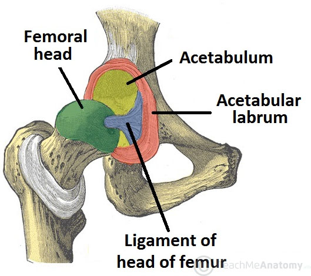

# Segmenting Femoral Head from Hip CT Image Dataset

## Introduction
This GitHub repository focuses on the segmentation of the femoral head from a publicly available CT image dataset, primarily designed for the study of diarthrodial joints at the Musculoskeletal Research Laboratories (MRL) of the University of Utah (https://mrl.sci.utah.edu/Links). The dataset comprises CT arthrograms of human diarthrodial joints and was originally created for finite element analysis of cartilage contact stresses within three study groups: normal hip, retroverted acetabula, and traditional acetabular dysplasia. In this project, we aim to adapt this dataset for the analysis of the pelvis, specifically focusing on the femoral and acetabular bone and cartilage.

## Tasks

Here, are the tasks you need to go through for this assignment:

1- Become fully acquainted with the dataset and how it is made by reading thoroughly
through the MRL webpage.

2- Download the data from the MRL webpage. You need to make a username and
password; the rest is straightforward. Download the first 5 patient data for the three
groups mentioned above.

3- To open the DICOM images in the dataset we use a software called ImageJ. Install
ImageJ from ( https://imagej.nih.gov/ij/download.html ) and load the data into it
(drag and drop the folder containing the images), use virtual stack so you see images
in one window as a video.

4- This is a 3-dimenssional data and images are taken in axial view. The images are from
both legs and goes all the way up to the spine. In this assignment we are interested
in femoral and acetabular cartilage. We want to generate the coronal and sagittal
view from the images by using MATLAB or Python.

5- Using axial view, choose the right ROI for each dataset to be able to see right side or
left side pelvic bone. Remember that you don’t need to use all the images (in Z
direction), just the ones that show the pelvic bone.

6- You need to detect the femoral head in the chosen ROI, you can use Hough
Transform. You may need to use some filtering to make the algorithm work.
7- The end goal is to segment the femoral and pelvis cartilage. Segmenting femoral
head can be the first step.

You can see a picture of the hip joint below:

